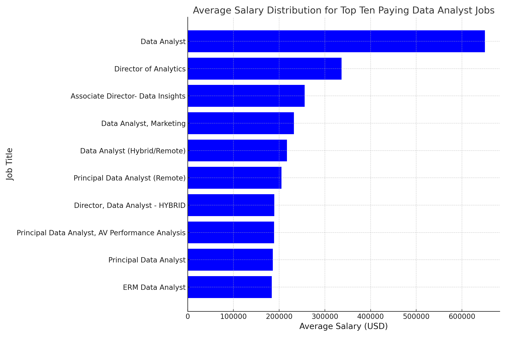

# Introductoon
 Dive into the the Data Job market! Focusing on Data analyst roles, this project emplores 💰 top-paying jobs, 🔥in demand skills, and where high demand meets high salary in data analytics.
  
  SQL queries? Check them out here [project_sql folder](/Project_sql/)
# Background 
Driven by a quest to navigate the data anlyst job more effectively, this project was born from a desire to pinpoint top-paid and In-demand skills, streamlining others work to find optimal jobs.


### The questions i wanted to answer through my sql querie were:
1. What ae the top-paying data analyst jobs?
2. What skills are required for these top paying jobs?
3. What skills are most In-demand for data analyst?
4. Which skills are associated with higher salaries.
5. What are tje most optimal skills to learn?
# Tools I Used
For my deep dive into the data analyst job market, I harnessed the power of several ley tools:
-**SQL**: The backbone of my analysis, allowing me to query the database and unearth the critical insights.
-**PostgreSQL**: The choosen database management system, ideal for handling the job posting data.
- **Visual Studio Code:** My go-to for database management and executing SQL queries.
- **Git and GitHub:** Essential for versio control and sharing my SQL scripts and analysis, ensuring collaboration and project tracking.

# The Analysis
Each query for this project aimed at investigating specific aspects of the data analyst job market.
Here is how i appraoched each question:

### 1. Top Paying Data Analyst Jobs
To identify highest-paying roles. I filtered data analyst positions by by average yearly salary and location, focusing on remote jobs. This query highlights the high pying opportunities in the field.

```sql
SELECT
    job_id,
    job_title,
    job_location,
    job_schedule_type,
    salary_year_avg,
    job_posted_date,
    name AS company_name
FROM
    job_postings_fact
LEFT JOIN company_dim ON job_postings_fact.company_id = company_dim.company_id
WHERE 
    job_title_short = 'Data Analyst' AND
    job_location = 'Anywhere' AND 
    salary_year_avg IS NOT NULL
ORDER BY
salary_year_avg DESC
LIMIT 10;
```
Here is the top data analyst jobs in 2023:

-**Wide Salary Range:** Top 10 paying data analyst roles span from $184,000 to $650,000, indicating significant salary potential in the field. 

-**Diverse Employers** Companies like smartAsset, Meta and AT&T are among those offering high salaries showing a broad interest accross diferent industries.

-**Job Title Variety** There's a high diversity in job titles, from Data Analysts to Director of Analytics, reflecting varied roles and specialization within Data Analytics



*Bar gragh visualizing the top ten salaries for data analysts; ChatGPT generated this gragh from my SQL results*

# What I learned

Throughout this adventure, I've turbocharged my SQL toolkit with some serious fire power:
-**Complext Query Crafting:** Mastered the art of advance SQL, merging tables like a pro and welding with Clauses for ninja-level temp table manaeuvers.
-**Data Aggregation:**
Got cozy with GROUP BY and turned aggregate functions like COUNT() and AVG() INTO my data-summarizing sidekicks.
-**Analytical Wizardry:** Levelled up my real world puzzle-solving skills, turning questions into actionable, insightful SQL queries.
# Conclusions 
### insights
1. **Top-Paying-Data-Analyst-Jobs**: The highest-paying jobs for data analysts that allow remote work offer a wide range of salaries, the highest at $650,000!

2. **Skills For Top-Paying Jobs**: High paying data analyst job require require advanced proficency in SQL, suggesting it is a critical skill for earning a top salary.

3.**Most In-Demand Skills**: SQL is also the most demanded skill in the data analyst job market, thus making it essential for job seekers.

4. **Skills With Higher Salary**: Specialised skills, such as SVN and Solidity, are associated wit highest average salaries, indicating a premium on niche expertise.

5. Optimal Skills For Job Market Value**: SQL leads in demand for a high average salary, positioning it as one of the most optimal skills for data analysts to learn to maximize their market value.

# Conclusion
### Closing Thoughts
This project enhanced my SQL skills and provided valuable insights into the data analyst job market. The finding from the serve as a guide to prioritizing skill development and job search effort. Aspiring data analysts can better position themselves in a competitive job market by focusing on high-demand, high-salary skills. This exploration highlights the importance of continous learning and adapatation to emerging trends in the field of data analytics.

